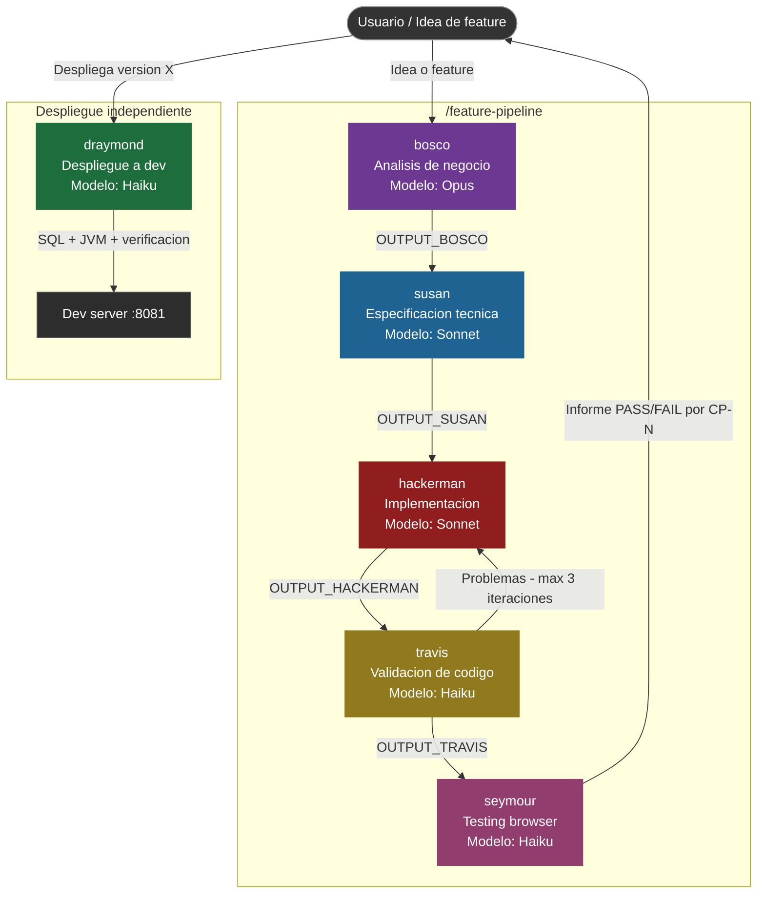

# Pipeline de Agentes — Gestmusica / Musicon

Documento de referencia del sistema de agentes IA configurado en `.claude/agents/` y la skill de orquestación `feature-pipeline`.

---

## Gráfico del flujo



---

## Resumen de agentes

### 🟣 bosco — Analista de Negocio y Producto
| Campo | Detalle |
|---|---|
| **Rol** | Product Manager / Business Analyst senior |
| **Modelo** | Claude Opus (máxima capacidad de razonamiento estratégico) |
| **DB** | Producción — solo lectura (`mcp__postgres-prod__query`) |
| **Entrada** | Idea o feature descrita por el usuario |
| **Salida** | Diagnóstico de valor, riesgos, recomendación con alcance |
| **Bloquea el pipeline si** | La feature no tiene valor de negocio claro o necesita más contexto del usuario |

Aplica marcos como RICE, MoSCoW, Value Proposition Canvas. Tiene acceso a datos reales de producción para fundamentar sus análisis. No es complaciente: si algo no tiene sentido lo dice.

---

### 🔵 susan — Analista de Requisitos y Especificación
| Campo | Detalle |
|---|---|
| **Rol** | Especialista en ingeniería de requisitos |
| **Modelo** | Claude Sonnet |
| **DB** | Producción — solo lectura (`mcp__postgres-prod__query`) |
| **Entrada** | `[OUTPUT_BOSCO]` + contexto del usuario |
| **Salida** | Especificación técnica completa (secciones 1-11) con casos de prueba CP-N |
| **Bloquea el pipeline si** | Los requisitos son ambiguos o contradictorios — pregunta antes de continuar |

Produce el documento de especificación que hackerman implementará sin ambigüedades. Incluye obligatoriamente casos de prueba funcionales numerados (CP-1, CP-2…) que seymour ejecutará después.

---

### 🔴 hackerman — Implementador Spring Boot
| Campo | Detalle |
|---|---|
| **Rol** | Desarrollador senior Spring Boot / Java 17 |
| **Modelo** | Claude Sonnet |
| **DB** | Desarrollo — solo lectura (`mcp__db__query`) |
| **Entrada** | `[OUTPUT_SUSAN]` — especificación completa |
| **Salida** | Código implementado: entidad, DTO, repositorio, servicio, controlador, Thymeleaf, SQL migrations |
| **Restricciones** | No toma decisiones arquitectónicas que contradigan la spec sin avisar |

Implementa todas las capas del patrón MVC del proyecto. Incluye scripts SQL en `/sql/` para migraciones. Puede ser invocado varias veces en el bucle de corrección con feedback de travis.

---

### 🟡 travis — Validador de Código
| Campo | Detalle |
|---|---|
| **Rol** | Code reviewer senior — correctitud, calidad, seguridad |
| **Modelo** | Claude Haiku (rápido, repetible en bucle) |
| **DB** | Desarrollo — solo lectura (`mcp__db__query`) |
| **Entrada** | `[OUTPUT_SUSAN]` + `[OUTPUT_HACKERMAN]` |
| **Salida** | Aprobación o lista de problemas bloqueantes/no-bloqueantes |
| **Bucle** | Hasta 3 iteraciones con hackerman. Si tras 3 rondas hay bloqueantes → detiene el pipeline |

Valida: correctitud funcional respecto a la spec, arquitectura del proyecto, seguridad OWASP Top 10, Spring Security, y cobertura de casos de prueba de susan.

---

### 🩷 seymour — QA Browser Tester
| Campo | Detalle |
|---|---|
| **Rol** | QA automatizado con Playwright |
| **Modelo** | Claude Haiku |
| **DB** | Desarrollo — solo lectura (`mcp__db__query`) |
| **Entrada** | `[OUTPUT_SUSAN]` (casos CP-N) + `[OUTPUT_TRAVIS]` + contexto de módulos |
| **Salida** | Informe estructurado: estado PASS / FAIL / BLOCKED por cada CP-N |
| **Puerto** | `localhost:8081` por defecto |

Ejecuta pruebas reales en el navegador usando Playwright. Navega, hace clic, rellena formularios y toma capturas. Genera un informe de resultados por versión.

---

### 🟢 draymond — Agente de Despliegue
| Campo | Detalle |
|---|---|
| **Rol** | DevOps — ciclo completo de despliegue a dev |
| **Modelo** | Claude Haiku |
| **DB** | Desarrollo — lectura vía MCP + escritura vía `psql` en Bash |
| **Activación** | Cuando una versión ha sido validada (fuera del pipeline principal) |
| **Flujo** | SQL migrations → Maven build → arranque JVM → verificación web → notificación |

No forma parte del pipeline `/feature-pipeline`. Se activa manualmente cuando el equipo quiere desplegar una versión validada al entorno de desarrollo.

---

## Resumen del flujo `/feature-pipeline`

```
FASE 1  bosco     →  ¿Vale la pena? ¿Con qué alcance?
FASE 2  susan     →  Especificación técnica + casos de prueba CP-N
FASE 3  hackerman →  Implementación completa (código + SQL)
FASE 4  travis    →  Validación (bucle corrección, máx. 3 rondas)
FASE 5  seymour   →  Testing en navegador real (Playwright)
```

### Reglas de orquestación

- **Orden estricto**: ninguna fase empieza si la anterior tiene bloqueantes sin resolver.
- **El usuario decide**: si un agente necesita información que no puede inferir, el pipeline se pausa y se le pregunta al usuario.
- **Contexto encadenado**: cada agente recibe el output de todos los anteriores relevantes.
- **Informe final**: tabla de estado por fase + veredicto `LISTO PARA MERGE` o `PENDIENTE DE CORRECCIONES`.

---

## Acceso a base de datos por agente

| Agente | Base de datos | Permisos |
|--------|--------------|---------|
| bosco | **Producción** | SELECT únicamente |
| susan | **Producción** | SELECT únicamente |
| hackerman | Desarrollo | SELECT únicamente (vía MCP) |
| travis | Desarrollo | SELECT únicamente (vía MCP) |
| seymour | Desarrollo | SELECT únicamente (vía MCP) |
| draymond | Desarrollo | SELECT (MCP) + DDL/DML completo (psql via Bash) |
